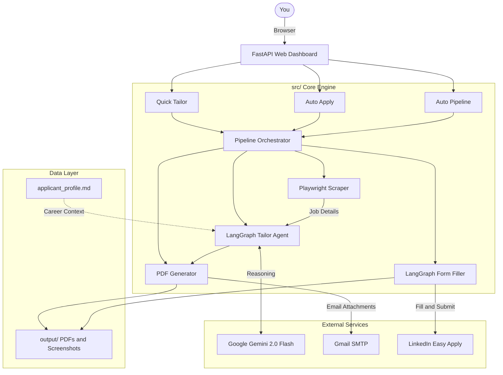

<div align="center">

<br />

# 🧠 Job Application Agent

### *Your Autonomous AI Career Wingman — Powered by Gemini, Playwright & LangGraph*

<br />

[](https://www.python.org/)
[](https://fastapi.tiangolo.com)
[](https://ai.google.dev/)
[](https://playwright.dev/)
[](https://langchain-ai.github.io/langgraph/)
[](https://cloud.google.com/run)

<br />

> **Stop manually rewriting your resume for every single job posting.**  
> Paste a URL or a job description. Watch AI generate a laser-targeted, ATS-optimized resume in under 30 seconds.

<br />

</div>

---

## 🎯 What This Does

The **Job Application Agent** automates the most painful parts of the job hunt. It reads your master career profile, understands what a specific employer is looking for, and rewrites your story to match it — perfectly, every time.

It's not a template filler. It uses **Google Gemini 2.0 Flash** to logically reason about which projects and skills to surface, which keywords to prioritize to pass ATS systems, and how to present you at your absolute best for the specific role.

Built on a clean, modular `src/` architecture with a premium dark-mode dashboard. Deployed to Google Cloud Run for zero-cost 24/7 availability.

---

## ✨ Features at a Glance

| Feature | Description | Where to Use |
|:---|:---|:---|
| ⚡ **Quick Tailor** | Paste any LinkedIn URL or raw Job Description → get a fully tailored Markdown resume in ~20s | 🌐 Cloud & 💻 Local |
| 🤖 **Auto Apply** | Playwright auto-fills Easy Apply forms on LinkedIn, pauses for your review, then submits | 💻 Local Only |
| 🏭 **Auto Pipeline** | Searches LinkedIn, scrapes top jobs, tailors all resumes, generates PDFs, emails them to you — fully automated | 💻 Local Only |
| 📄 **PDF Export** | Beautifully formatted PDF resumes generated via headless Chromium | 🌐 Cloud & 💻 Local |
| 🔒 **Human-in-the-Loop** | Auto Apply pauses with screenshots before submitting. You are always in control | 💻 Local Only |

---

## 🏗️ System Architecture

The agent is designed as a serverless, modular pipeline. Each stage is independently testable and can be run in isolation.



---

## 🛠️ Tech Stack

| Layer | Technology | Purpose |
|:---|:---|:---|
| **Web API** | FastAPI + Uvicorn | Async REST API & dashboard backend |
| **Frontend** | Vanilla JS / CSS | Dark-mode glassmorphism premium UI |
| **AI Reasoning** | Google Gemini 2.0 Flash | Resume tailoring & job text extraction |
| **Agent Workflow** | LangGraph | State-machine orchestration for the pipeline |
| **Web Automation** | Playwright (Chromium) | LinkedIn scraping, form filling, PDF rendering |
| **PDF Parsing** | pdfplumber | Reading your master resume PDF |
| **Notifications** | smtplib / Gmail | Emailing the final tailored PDFs |
| **Cloud Hosting** | Google Cloud Run | Free, serverless 24/7 dashboard |

---

## 🚀 Getting Started (Local)

### Prerequisites
- **Python 3.11+**
- A **Google Gemini API Key** → [Get one free at Google AI Studio](https://aistudio.google.com/apikey)
- A **Gmail App Password** → [Google Account → Security → App Passwords](https://myaccount.google.com/apppasswords)
- **LinkedIn credentials** for auto-apply features

### 1. Clone & Install

```bash
git clone https://github.com/phanikolla/JobApplicationAgent.git
cd JobApplicationAgent

# Create and activate a virtual environment
python -m venv venv
venv\Scripts\activate          # Windows
# source venv/bin/activate     # Mac / Linux

# Install Python dependencies
pip install -r requirements.txt

# Install Playwright's headless Chromium browser
playwright install chromium
```

### 2. Configure Secrets

```bash
cp .env.template .env
```

Open `.env` and fill in your values:

```env
# ── AI ──────────────────────────────────────────────
GEMINI_API_KEY=your_gemini_api_key_here

# ── Email Notifications ──────────────────────────────
EMAIL_SENDER=yourname@gmail.com
EMAIL_APP_PASSWORD=your_gmail_app_password_here

# ── Security (Auto Pipeline trigger) ─────────────────
TRIGGER_TOKEN=any_random_secret_token_here
```

> ⚠️ **Never commit your `.env` file.** It is already excluded in `.gitignore`.

### 3. Set Up Your Career Profile

Place the following two files in the **project root**:
- **`Phani_Kumar_Kolla_profile.pdf`** — Your master resume PDF
- **`applicant_profile.md`** — Your detailed profile (used for form filling & tailoring context)

Edit `config.json` to add your LinkedIn credentials and personal details (used for auto-filling job applications).

### 4. Launch the Dashboard

```bash
python -m uvicorn src.api.server:app --host 127.0.0.1 --port 8000 --reload
```

Open **[http://localhost:8000](http://localhost:8000)** in your browser. 🎉

---

## ☁️ Deploy to Cloud for Free

Access your **Quick Tailor** dashboard 24/7 from anywhere — your phone, iPad, or any browser — with a permanent `https://` URL. Zero infrastructure to manage. Zero cost, forever.

**How?** Google Cloud Run "Scales to Zero." The server turns off when you close the tab. You only pay for the exact seconds you're generating a resume, and Google gives you **360,000 free seconds every month**.

### One-Command Deploy

```bash
# 1. Authenticate (first time only)
gcloud auth login
gcloud config set project YOUR_PROJECT_ID

# 2. Deploy 🚀
.\infra\deploy-gcp.ps1       # Windows
# ./infra/deploy.sh          # Mac / Linux
```

Takes ~3-5 minutes. At the end you get a permanent URL like:
```
https://job-agent-xxxxxx.us-central1.run.app
```

### Cost Comparison

| Hosting Strategy | Monthly Cost | Notes |
|:---|:---:|:---|
| **Google Cloud Run** ✅ | **$0.00** | Scales to zero. Free tier resets monthly forever |
| AWS EC2 t3.micro | ~$3.50 | Always-on, requires manual management |
| AWS Fargate + ALB | ~$18.00 | Fixed ALB fee even when idle |
| GCP Compute Engine e2-micro | ~$2.50 | Always-on VM |

---

## 📂 Project Structure

```
JobApplicationAgent/
│
├── src/                        # 🧩 Modular Application Source
│   ├── api/
│   │   └── server.py           # FastAPI app: all routes & SSE events
│   ├── core/
│   │   └── config.py           # Config loading (config.json + env vars)
│   ├── agents/
│   │   ├── tailor_agent.py     # LangGraph graph for ATS resume tailoring
│   │   └── form_filler.py      # LangGraph graph for LinkedIn form automation
│   ├── scrapers/
│   │   ├── job_url_scraper.py  # Playwright: scrape job details from a URL
│   │   └── linkedin_search.py  # Playwright: search LinkedIn for job listings
│   ├── models/
│   │   ├── profile_parser.py   # pdfplumber: parse master resume PDF
│   │   └── resume_manager.py   # Manage tailored resume output files
│   ├── utils/
│   │   └── notifier.py         # Gmail SMTP email sender
│   └── main.py                 # Pipeline orchestrator (called by server + CLI)
│
├── static/                     # 🎨 Frontend (Served by FastAPI)
│   ├── index.html              # Dashboard shell (Tab navigation)
│   ├── styles.css              # Dark-mode glassmorphism design system
│   └── app.js                  # All client-side async logic
│
├── infra/                      # ☁️ Infrastructure as Code
│   ├── deploy-gcp.ps1          # 1-click Google Cloud Run deploy (Windows)
│   ├── deploy.sh               # 1-click AWS ECS Fargate deploy (Linux)
│   ├── deploy.ps1              # 1-click AWS ECS Fargate deploy (Windows)
│   ├── ecr.yaml                # AWS CloudFormation: ECR Repository
│   ├── ecs.yaml                # AWS CloudFormation: ECS Cluster + Task
│   ├── api_trigger.yaml        # AWS CloudFormation: API Gateway + Lambda
│   └── api_trigger.yaml        # GCP Cloud Run auto-deploy source config
│
├── docs/                       # 📘 Documentation
│   ├── aws_deployment_guide.md # Deep-dive: AWS Fargate architecture
│   └── gcp_deployment_guide.md # Step-by-step: GCP Cloud Run setup
│
├── Dockerfile                  # Container: Python 3.11 + Playwright + Chromium
├── requirements.txt            # Python dependencies
├── config.json                 # App config: LinkedIn prefs, personal details
├── applicant_profile.md        # Master career profile for AI context
├── .env.template               # Secret keys template
└── .gitignore                  # Protects .env and output/*
```

---

## 🧑‍💻 How the "Quick Tailor" Works (Under the Hood)

When you hit **Tailor Resume**, here is what happens in sequence:

1. **Input Parsing** — The server receives either a LinkedIn `job_url` or raw `job_text`.
2. **Job Description Extraction** — If a URL is provided, Playwright launches a headless Chromium browser, navigates to the page, and extracts the full job description. If raw text is given, Gemini parses it to extract the job title, company, and key requirements.
3. **Profile Loading** — `profile_parser.py` reads your master `Phani_Kumar_Kolla_profile.pdf` to extract all your career history, projects, and skills.
4. **ATS Analysis** — `tailor_agent.py` sends both pieces to Gemini with a carefully engineered prompt. Gemini identifies the top ATS keywords, maps them to your actual experience, and generates a version of your resume that maximizes keyword match percentage.
5. **PDF Generation** — `resume_manager.py` converts the tailored Markdown to styled HTML and uses a headless Playwright browser to render it as a pixel-perfect PDF.
6. **Live Streaming** — The server uses **Server-Sent Events (SSE)** to stream status updates to the dashboard in real-time, so you see "Analyzing JD... ✓ Identifying keywords... ✓ Generating..."

---

<div align="center">

---

*Built with obsession. Ship smarter, not harder.*

**[⭐ Star this repo](https://github.com/phanikolla/JobApplicationAgent)** if it helped you land an interview!

</div>
